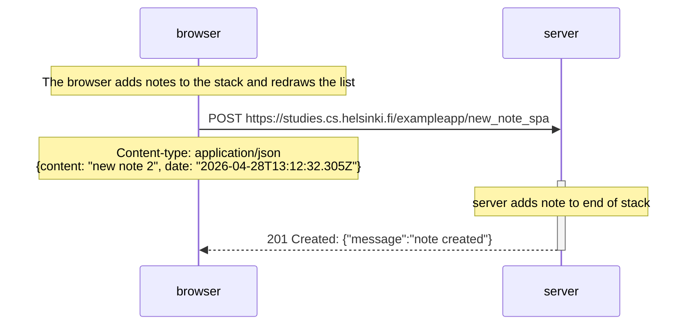

```mermaid
sequenceDiagram
    participant browser
    participant server

    Note over browser: The browser adds notes to the stack and redraws the list
    browser->>server: POST https://studies.cs.helsinki.fi/exampleapp/new_note_spa
    Note over browser: Content-type: application/json<br/>{content: "new note 2", date: "2026-04-28T13:12:32.305Z"}
    activate server
    Note over server: server adds note to end of stack
    server-->>browser: 201 Created: {"message":"note created"}
    deactivate server
```
